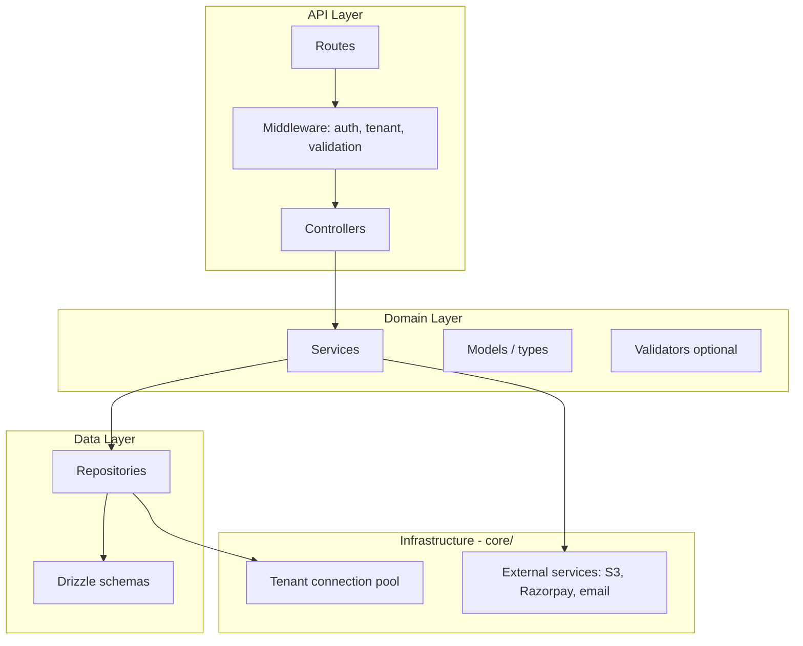
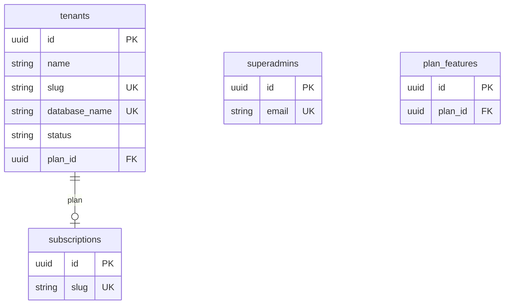
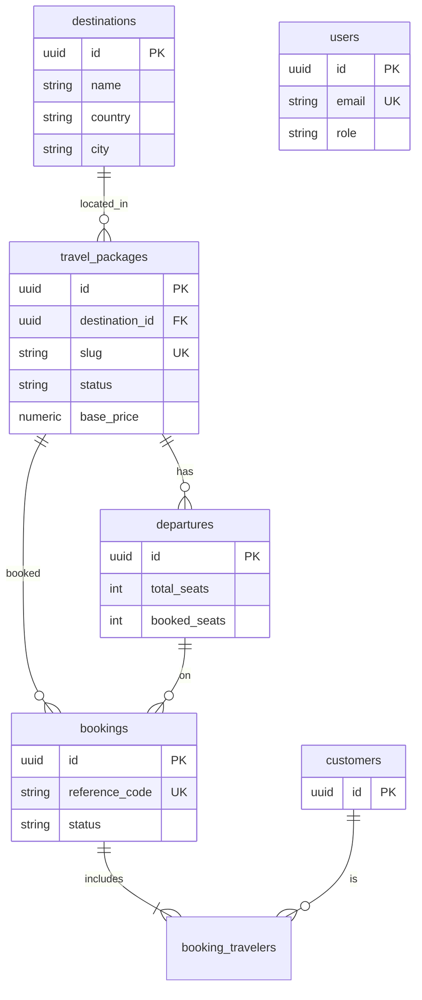
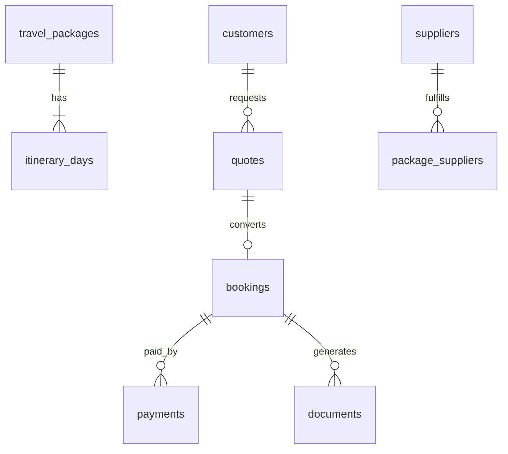

# Travel SaaS — Architecture (Requirements)

# **\*\***NEED TO BE UPDATED **\*\*\***

**Single source of truth** for how this backend is built, extended, and reviewed.  
All new features for the **core travel website** must follow this document.

Related docs:

| Document                                               | Purpose                                              |
| ------------------------------------------------------ | ---------------------------------------------------- |
| [TRAVEL_SAAS_BLUEPRINT.md](./TRAVEL_SAAS_BLUEPRINT.md) | Portable template (folder tree, copy-paste patterns) |
| [docs/SAAS-MIGRATION.md](./docs/SAAS-MIGRATION.md)     | Phased delivery plan (current → full product)        |
| [AGENTS.md](./AGENTS.md)                               | Rules for AI-assisted development in this repo       |
| [README.md](./README.md)                               | Setup, scripts, quick API reference                  |

---

## 1. Product scope (core travel website)

This backend powers **multi-tenant travel agencies** (tour operators / DMCs). Each tenant is an agency with its own PostgreSQL database.

### Platform (every deployment)

| Capability        | Module                          | Status                          |
| ----------------- | ------------------------------- | ------------------------------- |
| Agency onboarding | `tenant-management`             | Implemented                     |
| Platform admin    | `superadmin`                    | Implemented                     |
| Staff auth (JWT)  | `auth`                          | Implemented                     |
| Subscriptions     | `subscription`                  | Schema only — routes pending    |
| RBAC              | `users`, `roles`, `permissions` | Schema partial — routes pending |

### Core travel domain (required for MVP website)

| Capability                  | Module           | Status                             |
| --------------------------- | ---------------- | ---------------------------------- |
| Agency profile / branding   | `agency`         | Planned                            |
| Destinations catalog        | `destinations`   | Implemented                        |
| Tour packages               | `packages`       | Implemented                        |
| FAQs                        | `faq`            | Implemented                        |
| Departures & seats          | `inventory`      | Schema only                        |
| Travelers / CRM             | `customers`      | Schema only                        |
| **Bookings**                | `bookings`       | **Implemented (reference module)** |
| Package enquiries           | `packageEnquery` | Implemented                        |
| Quotes                      | `quotes`         | Planned                            |
| Payments                    | `payments`       | Planned                            |
| Documents (vouchers, visas) | `documents`      | Planned                            |
| Public storefront API       | `public`         | Planned                            |

### Explicit non-goals (v1)

- Single shared DB with `tenantId` column (we use **database-per-tenant**)
- Business logic in controllers or routes
- In-memory repositories in production paths

---

## 2. Technical stack

| Layer         | Technology                                 |
| ------------- | ------------------------------------------ |
| Runtime       | Node.js 20+                                |
| Framework     | Express 4                                  |
| Language      | TypeScript (strict)                        |
| ORM           | Drizzle                                    |
| Database      | PostgreSQL 14+                             |
| Validation    | class-validator + class-transformer (DTOs) |
| Auth          | JWT (Bearer)                               |
| Multi-tenancy | Database-per-tenant + master registry      |

---

## 3. Layered architecture (required)



### Layer rules (mandatory)

| Layer            | Location                      | MUST do                                              | MUST NOT do                                      |
| ---------------- | ----------------------------- | ---------------------------------------------------- | ------------------------------------------------ |
| **Routes**       | `modules/*/routes/`           | HTTP method, path, middleware chain                  | Business rules, DB access                        |
| **Middleware**   | `core/middleware/`            | Auth, tenant resolve, DTO validation                 | Domain rules                                     |
| **Controllers**  | `modules/*/controllers/`      | Read `req`, call service, `sendResponse`             | DB queries, slug/status logic, `res.json` ad hoc |
| **Services**     | `modules/*/services/`         | Business rules, orchestration, throw `HttpException` | `res` / Express types                            |
| **Repositories** | `modules/*/repositories/`     | Drizzle queries, transactions                        | HTTP, validation messages for clients            |
| **DTOs**         | `modules/*/dto/`              | Input shape + class-validator decorators             | —                                                |
| **Models**       | `modules/*/models/`           | TypeScript interfaces for API/domain shapes          | —                                                |
| **Schemas**      | `core/database/schemas/`      | Tables, relations, migrations                        | API responses                                    |
| **Core utils**   | `core/utils/`, `core/config/` | Cross-cutting helpers                                | Feature-specific rules                           |

**Reference implementation:** `modules/bookings/` — copy this pattern for every new module.

### Standard tenant-scoped route chain

```text
authenticationMiddleware → tenantResolver → validationMiddleware(Dto) → controller.method
```

### Standard controller shape (function-based)

```typescript
export const createBooking = asyncHandler(
  async (req: Request, res: Response): Promise<void> => {
    const result = await bookingService.createBooking(
      req.tenantId!,
      req.body,
      req.user?.id,
    );
    sendResponse(res, result, HttpStatus.CREATED);
  },
);
```

### Standard service shape

```typescript
export const createBooking = async (
  tenantId: string,
  dto: CreateBookingDto,
  userId?: string,
) => {
  // business rules, throw HttpException
  return bookingRepository.createBooking(tenantId, dto, userId);
};
```

### Standard repository shape

```typescript
export const createBooking = async (
  tenantId: string,
  dto: CreateBookingDto,
) => {
  return withTenantDb(tenantId, async (db) => {
    // db.insert(...).returning()
  });
};
```

**Note:** DTOs remain `class` definitions (required by class-validator). Domain layers use **named exported functions**, not classes.

---

## 4. Multi-tenancy model

### Databases

| Database                    | Contents                                                                |
| --------------------------- | ----------------------------------------------------------------------- |
| **Master**                  | `auth.tenants`, `auth.superadmins`, `subscription.*`, `global_settings` |
| **Tenant** (one per agency) | Users, packages, bookings, customers, payments, etc.                    |

Isolation is by **separate PostgreSQL database**, not a `tenantId` column on every row.

### Tenant resolution (priority)

1. Header `x-tenant-id`
2. JWT claim `tenantId`
3. Subdomain → lookup in `auth.tenants` (planned for public site)

### Master vs tenant data access

| Data                               | Access                        |
| ---------------------------------- | ----------------------------- |
| Tenant registry, superadmin, plans | `masterDb`                    |
| All agency business data           | `withTenantDb(tenantId, ...)` |

---

## 5. Folder structure

```text
src/
├── server.ts              # Bootstrap: ensure master DB, listen
├── app.ts                 # Express app, route mounting
├── core/                  # Shared — do not put feature logic here
│   ├── config/
│   ├── constants/
│   ├── database/
│   ├── exceptions/
│   ├── helper/
│   ├── interfaces/
│   ├── middleware/
│   ├── types/
│   └── utils/
└── modules/               # One folder per bounded context
    └── {feature}/
        ├── routes/
        ├── controllers/
        ├── services/
        ├── repositories/
        ├── models/
        ├── dto/
        └── validators/    # optional
```

Path aliases: `@/core/*`, `@/modules/*` (see `tsconfig.json`).

---

## 6. API conventions

### Versioning

All HTTP APIs live under:

```text
{API_PREFIX}   # default: /api/v1
```

### Response envelope (required)

**Success:**

```json
{
  "success": true,
  "status_code": 200,
  "data": {}
}
```

**Error:**

```json
{
  "success": false,
  "message": "Human-readable message",
  "error_code": "BOOKING_NOT_FOUND",
  "status_code": 404
}
```

Use `sendResponse` and throw `HttpException` from services — never invent new shapes per module.

### Error handling

- Services throw `HttpException` (or domain-specific subclasses)
- Controllers use `asyncHandler` — no try/catch per method
- `errorHandler` middleware in `core/middleware/errorHandler.middleware.ts` formats all errors

### Auth

| Actor        | Prefix                   | DB           |
| ------------ | ------------------------ | ------------ |
| Superadmin   | `/api/v1/superadmin`     | Master       |
| Agency staff | `/api/v1/auth`           | Tenant       |
| Tenant APIs  | `/api/v1/bookings`, etc. | Tenant + JWT |

JWT payload:

```typescript
{ sub: userId, role: string, tenantId?: string }
```

---

## 7. Current API map

| Prefix                      | Module            | Scope                        | Status  |
| --------------------------- | ----------------- | ---------------------------- | ------- |
| `GET /health`               | —                 | —                            | Live    |
| `/api/v1/admin/tenants`     | tenant-management | Master                       | Live    |
| `/api/v1/superadmin`        | superadmin        | Master                       | Live    |
| `/api/v1/auth`              | auth              | Tenant                       | Live    |
| `/api/v1/bookings`          | bookings          | Tenant                       | Live    |
| `/api/v1/packages`          | packages          | Tenant                       | Live    |
| `/api/v1/destinations`      | destinations      | Tenant                       | Live    |
| `/api/v1/faqs`              | faq               | Tenant                       | Live    |
| `/api/v1/package-enquiries` | packageEnquery    | Tenant                       | Live    |
| `/api/v1/customers`         | customers         | Tenant                       | Planned |
| `/api/v1/inventory`         | inventory         | Tenant                       | Planned |
| `/api/v1/quotes`            | quotes            | Tenant                       | Planned |
| `/api/v1/payments`          | payments          | Tenant                       | Planned |
| `/api/v1/public/*`          | public            | Tenant resolve via subdomain | Planned |

---

## 8. Data model

### Master DB (implemented)



### Tenant DB (implemented schemas)



### Tenant DB (planned — core website)



PostgreSQL **named schemas** inside each tenant DB: `auth`, `packages`, `inventory`, `customers`, `bookings`, etc. (see `core/database/schemas/tenant/`).

---

## 9. Core travel flows (requirements)

### Flow A — Agency onboarding

```text
POST /admin/tenants → create master row → CREATE DATABASE → migrate tenant → return tenant
```

On failure: rollback master row (see `tenant.repository.ts`).

### Flow B — Catalog (to implement)

```text
destinations → packages → itineraries → departures → publish package
```

Package must be `published` before booking (enforced in `booking.repository.ts`).

### Flow C — Booking (implemented)

```text
POST /bookings → validate package + departure capacity → transaction:
  insert booking + travelers → increment booked_seats
```

### Flow D — Quote → booking (planned)

```text
POST /quotes → PATCH accept → POST /bookings from quote → payment → document/voucher
```

### Flow E — Payment (planned)

```text
Razorpay order → webhook → update booking status + payments table
```

Payment logic lives in `core/` or `modules/payments/services/` — never in controllers.

---

## 10. Cross-cutting requirements

### Security

- Helmet + CORS (no `*` in production — set `CORS_ORIGIN`)
- All tenant routes: JWT + `tenantResolver`
- Admin/tenant creation endpoints: protect before production (API key or superadmin-only)
- Passwords: bcrypt via `encryption.util.ts`
- File uploads (future): auth + tenant-scoped S3 keys

### Validation

- Request bodies: DTO classes + `validationMiddleware`
- UUIDs in params: `String(req.params.id)` or dedicated param DTOs
- Business rules (e.g. pax vs travelers count): **service layer**

### Logging

- Use `logger` from `core/utils/logger.util.ts`
- Never log passwords, tokens, or full card data

### Migrations

- Master changes: `npm run generate:master` → `npm run migrate:master`
- Tenant template: `npm run generate:tenant` → `migrate:tenant` or auto on tenant create
- Never edit applied migration SQL by hand without team agreement

### Testing (target)

- Unit: services with mocked repositories
- Integration: repositories against test PostgreSQL
- E2E: booking flow with seeded tenant DB

---

## 11. External integrations (planned)

| Service  | Module / location                        | Rule                                    |
| -------- | ---------------------------------------- | --------------------------------------- |
| Razorpay | `modules/payments/services/`             | Webhook idempotency, no secrets in repo |
| AWS S3   | `core/services/s3.service.ts` (to add)   | Presigned URLs, tenant-prefixed keys    |
| Email    | `core/services/mail.service.ts` (to add) | Templates per tenant                    |

Infrastructure services **must not** contain booking/pricing rules.

---

## 12. Definition of done (new module)

Before a module is considered complete:

- [ ] Routes mounted in `app.ts` under `/api/v1/...`
- [ ] Controller uses `asyncHandler` + `sendResponse` only
- [ ] Service throws `HttpException` with `ErrorCodes`
- [ ] Repository uses `withTenantDb` (or `masterDb` for platform)
- [ ] DTO with class-validator for all write endpoints
- [ ] Drizzle schema + migration generated
- [ ] Documented in this file’s API map (PR update)
- [ ] No orphan files; no business logic duplicated in controllers

---

## 13. Anti-patterns (do not merge)

| Anti-pattern                             | Correct approach                 |
| ---------------------------------------- | -------------------------------- |
| `res.json()` directly in controller      | `sendResponse` / `HttpException` |
| Drizzle in controller                    | Repository                       |
| Slug generation in controller            | Service                          |
| Skipping `tenantResolver` on tenant data | Always resolve tenant            |
| Shared collections with only `tenantId`  | Separate tenant database         |
| try/catch in every controller method     | `asyncHandler`                   |
| New error JSON shape                     | Standard envelope + `error_code` |

---

## 14. Document maintenance

When you add a module, route, or schema:

1. Update **§7 API map** and **§8 ER** in this file
2. Update phase checklist in [docs/SAAS-MIGRATION.md](./docs/SAAS-MIGRATION.md)
3. Keep [README.md](./README.md) setup steps accurate

---

_This architecture supersedes ad hoc patterns. If code disagrees with this doc, fix the code or update this doc in the same PR._
