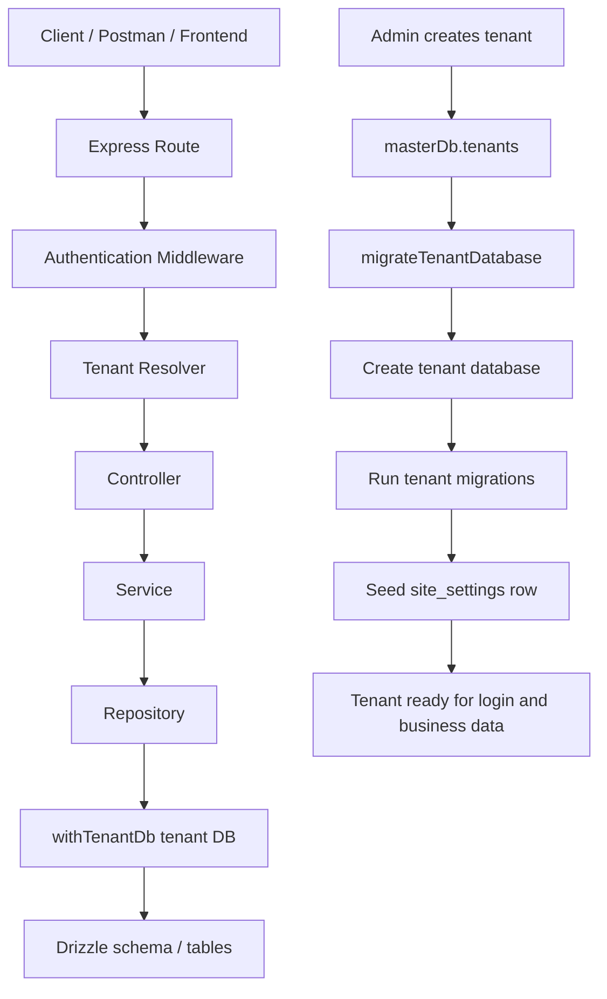

# Travel SaaS Backend

Multi-tenant travel agency backend built with Node.js, Express, TypeScript, Drizzle ORM, and PostgreSQL.

This repository uses a **database-per-tenant** model. Each agency gets its own PostgreSQL database, while platform-wide data such as tenants and superadmins stays in the master database.

## System Flow



### Actual request flow

1. A platform admin creates a new tenant through `/api/v1/admin/tenants`.
2. The tenant is inserted into the master database in `auth.tenants`.
3. The app creates a dedicated tenant database for that agency.
4. Tenant migrations are applied to that new database.
5. The `site_settings` row is seeded once for that tenant.
6. The tenant owner logs in through `/api/v1/auth/login`.
7. For tenant-scoped APIs, `tenantResolver` sets `req.tenantId`.
8. Controllers pass `req.tenantId` into services.
9. Services call repositories.
10. Repositories use `withTenantDb(tenantId, ...)` to query the correct tenant database.

That means bookings, destinations, packages, customers, FAQs, enquiries, and site settings all stay isolated per tenant database.

## Key Concepts

### Master database

The master database stores platform data:

- `auth.tenants`
- `auth.superadmins`
- subscription/platform records

### Tenant database

Each tenant database stores agency data:

- users and refresh tokens
- destinations
- packages
- departures
- customers
- bookings
- FAQs
- enquiries
- site settings

### Site settings

`site_settings.site_settings` is created once per tenant database during provisioning.

- `GET /api/v1/site-settings` returns the row for the active tenant.
- `GET /api/v1/site-settings/site-settings` fetches the same row by slug.
- `PATCH /api/v1/site-settings` updates the seeded row for that tenant.

## How tenancy is resolved

The app resolves the active tenant from the request context in this order:

1. `x-tenant-id` header
2. JWT claim `tenantId`
3. Subdomain or tenant header fallback, depending on the route

Once resolved, the controller uses `req.tenantId` to reach the correct tenant database.

## Example flows

### 1. Create a tenant

```http
POST /api/v1/admin/tenants
```

The request creates:

- the tenant record in `masterDb`
- the tenant database
- the tenant migrations
- the initial `site_settings` row
- the first owner user

### 2. Login for that tenant

```http
POST /api/v1/auth/login
```

The request is resolved to the correct tenant and returns tenant-scoped auth cookies.

### 3. Create tenant data

Examples:

- `POST /api/v1/destinations`
- `POST /api/v1/packages`
- `POST /api/v1/bookings`
- `PATCH /api/v1/site-settings`

All of these run against the active tenant database only.

## Testing multiple domains in Postman

Because this app is database-per-tenant, the cleanest way to test multiple domains is to use one Postman environment per tenant.

### Recommended setup

Create two environments:

- `Travel SaaS - Himalayan`
- `Travel SaaS - Annapurna`

For each environment, set:

- `tenantSubdomain`
- `ownerEmail`
- `ownerPassword`

Then run tenant creation once in each environment. Postman will keep the tenant data isolated because each environment points to a different tenant.

### Example values

**Environment A**

- `tenantSubdomain = himalayan-tours`
- `ownerEmail = owner@himalayan-tours.com`
- `ownerPassword = password123`

**Environment B**

- `tenantSubdomain = annapurna-expeditions`
- `ownerEmail = owner@annapurna-expeditions.com`
- `ownerPassword = password123`

## Setup

```bash
npm install
npm run db:up
npm run db:setup
npm run dev
```

## Scripts

```bash
npm run dev
npm run build
npm run db:setup
npm run migrate:master
npm run migrate:tenant -- <database_name>
npm run migrate:all-tenants
```

## API base path

All HTTP APIs are mounted under:

```text
/api/v1
```

## Reference modules

- `src/modules/bookings/` is the main reference for tenant-scoped CRUD patterns.
- `src/modules/tenant-management/` shows how tenant provisioning works.
- `src/modules/site-settings/` shows the seeded single-row settings flow.

## Related docs

- [ARCHITECTURE.md](./ARCHITECTURE.md)
- [AGENTS.md](./AGENTS.md)
- [docs/POSTMAN.md](./docs/POSTMAN.md)
- [TRAVEL_SAAS_BLUEPRINT.md](./TRAVEL_SAAS_BLUEPRINT.md)
